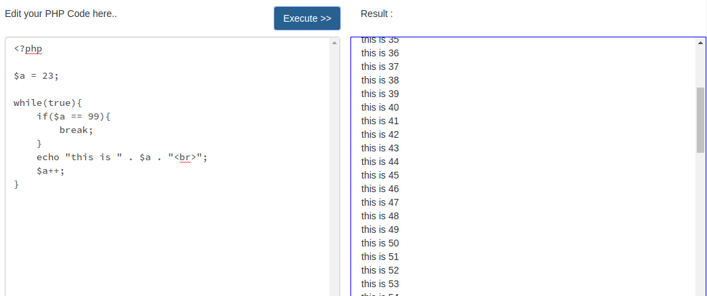

# Simple PHP Code Editor



## Syarat
1. Web Server
2. PHP
3. Web browser

## Cara Pakai

Cukup ***clone*** repositori ini, letakkan di ***folder*** yang dapat dijangkau secara publik di web Server Anda.

Edit file **index.html** , sesuaikan ***mainURL*** dengan kondisi di Web Server Anda. (dengan akhiran '/' diakhir)

```html

...

<form>

<!-- PLACE YOUR HOME URL HERE (WITH TRAILING SLASH) -->
<!--
EXAMPLE
<input type="hidden" name="mainUrl" value="http://localhost:8080/simple-php-code-editor/">
-->

<input type="hidden" name="mainUrl" value="http://localhost:8080/simple-php-code-editor/">

<textarea name="textarea" class="form-control"><?php</textarea>


</form>

...

```

# Perhatian
Anda harus memberikan hak akses pada seluruh ***folder*** **api** dan ***file*** yang ada didalamnya supaya aplikasi dapat berjalan.

```bash
cd simple-php-code-editor
chmod 777 -R api/
```

Setelah itu cukup nyalakan web server Anda.

Jika Memakai PHP versi 5.4 keatas, Anda dapat langsung menjalankan web Server bawaan PHP.

```bash
user@hostname /path/to/simple-php-code-editor $ php -S localhost:8080
```
